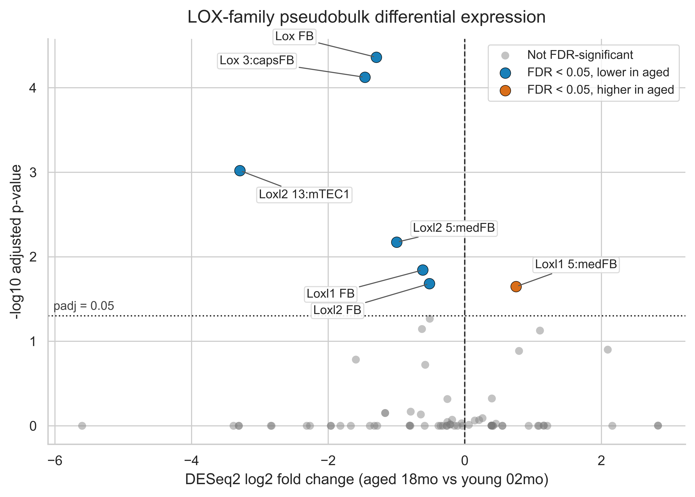
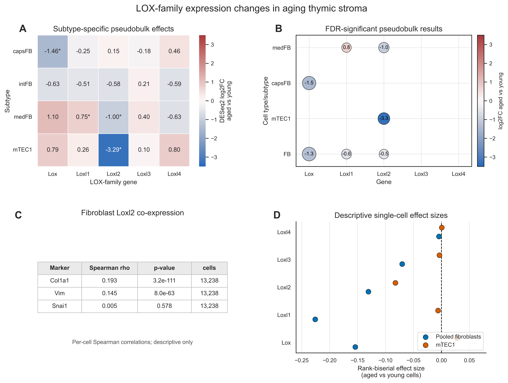

# Subtype-dependent LOX-family transcript changes in aging murine thymic stroma

**Author:** Aliaksandr Karatseyeu  
**Affiliation:** Independent researcher  
**Correspondence:** https://github.com/G1F12/ThymusLOXScan

## Abstract

The lysyl oxidase (LOX) family has been implicated in extracellular matrix remodeling and aging in multiple tissues, but its role in thymic stromal aging remains unclear. Here, we performed a computational reanalysis of the public GSE240016 single-cell RNA-seq dataset, comprising 22,932 CD45-negative thymic stromal cells from young (2-month) and aged (18-month) female C57BL/6 mice. Pseudobulk and sample-level summaries showed subtype-dependent LOX-family transcript differences rather than a uniform fibroblast-wide pattern. Capsular fibroblasts showed lower `Lox` in aged samples (log2FC = -1.46, padj = 7.5e-5), while medullary fibroblasts showed divergent changes, with `Loxl1` increased and `Loxl2` decreased in aged samples. In the mTEC1 epithelial compartment, `Loxl2` showed an aged-lower pseudobulk estimate and very low aged-cell detection, but this comparison included only two young and two aged biological samples. In a very small fibroblast composition-adjusted sensitivity model, the age coefficients for `Lox`, `Loxl1`, and `Loxl2` remained aged-lower, but the model had only six samples and one residual degree of freedom. Detection-rate decomposition suggested that several findings, especially medullary fibroblast and mTEC1 `Loxl2`, largely reflected fewer expressing cells. Annotation sanity checks found expected marker expression to varying degrees in capsFB, intFB, medFB, and mTEC1 labels, and the four focal transcript directions had the same sign in stricter marker-positive subsets. As a sorted bulk RNA-seq, broad-cell-type external comparison, GSE223049 was directionally consistent only with broad aged-lower thymic fibroblast `Lox` and `Loxl2` and broad thymic epithelial `Loxl2`; it was not subtype-resolved validation and could not test medullary fibroblast-specific `Loxl1`. Together, these analyses nominate subtype-dependent LOX-family transcript differences as a hypothesis-generating feature of murine thymic stromal aging, with `Loxl2` emerging as a recurrent candidate transcript marker requiring orthogonal experimental follow-up.

## Introduction

Age-associated thymic involution is accompanied by reduced thymic output and changes in the thymic stromal microenvironment, including epithelial and mesenchymal compartments that support T cell development [1-4]. Recent single-cell and spatial transcriptomic analyses of murine thymic aging identified age-associated epithelial states and stromal changes in public datasets [5,6]. These public data provide an opportunity to examine additional stromal gene programs in a transparent reanalysis.

The lysyl oxidase family, including LOX and LOX-like enzymes LOXL1-4, encodes secreted copper-dependent amine oxidases involved in extracellular matrix biology, particularly collagen and elastin crosslinking [7,8]. LOX-family genes have also been linked to tissue remodeling, fibrosis, cancer-associated matrix organization, and age-related extracellular matrix changes in multiple contexts [9,10]. Individual family members can have distinct biological associations: LOXL1 is required for elastic fiber homeostasis [11], while LOXL2 has been implicated in collagen IV crosslinking, basement membrane organization, and epithelial or endothelial tissue remodeling [12,13].

Here we reanalyzed the public GSE240016 murine thymic stromal single-cell RNA-seq dataset to assess LOX-family expression in young and aged CD45-negative thymic stromal cells [5,6]. We used pseudobulk differential expression with biological samples as replicates as the primary inferential framework, with descriptive single-cell summaries, per-sample checks, and correlation analyses as supporting context. The goal was not to prove a mechanism, but to identify candidate stromal expression patterns that may motivate future experimental validation and independent subtype-resolved replication.

## Results

### Dataset and analysis overview

We analyzed the public GSE240016 annotated single-cell RNA-seq dataset of CD45-negative murine thymic stromal cells from young (`02mo`) and aged (`18mo`) mice at steady state [5,6]. The repository input file was `data/raw/GSE240016_CD45neg_thymic_stroma_d0+annotation.h5ad`, corresponding to the GEO supplementary file named GSE240016_CD45neg_thymic_stroma_d0+annotation.h5ad. The analyzed local file contained 22,932 cells and metadata fields for age, biological sample, broad cell type, and fine subtype. Downstream analyses focused on the LOX-family genes `Lox`, `Loxl1`, `Loxl2`, `Loxl3`, and `Loxl4`.

The main inferential analysis used pseudobulk DESeq2, in which raw counts were summed within each biological sample and cell type or subtype before age comparison. Major pseudobulk results are reported in `results/tables/lox_pseudobulk_complete_results.tsv` and Supplementary Table 2. Cell counts by sample and annotation are reported in Supplementary Table 1. Descriptive single-cell tests are reported in `results/sc_mannwhitney_FB_combined.csv`, `results/sc_mannwhitney_mTEC1.csv`, and Supplementary Table 3. Correlation results are reported in `results/sc_spearman_correlations.csv` and Supplementary Table 4.

### Broad fibroblast summaries show reduced LOX-family expression but are composition-sensitive

At the broad fibroblast level, pseudobulk DESeq2 estimated lower expression of several LOX-family genes in aged samples. `Lox` was lower in aged fibroblasts (log2FC = -1.29, padj = 4.36e-5), as were `Loxl1` (log2FC = -0.62, padj = 0.014) and `Loxl2` (log2FC = -0.52, padj = 0.021). These broad fibroblast-level pseudobulk results used three young and three aged biological samples and are shown in Figure 1 and `results/tables/lox_pseudobulk_complete_results.tsv`. However, broad fibroblast summaries pool capsular, interstitial, medullary, and fat-associated fibroblast states, so they are not treated here as the central biological conclusion.

Descriptive single-cell tests showed the same general direction for all five LOX-family genes in pooled fibroblasts, with lower expression in aged cells for `Lox`, `Loxl1`, `Loxl2`, `Loxl3`, and `Loxl4`. The largest rank-biserial effect sizes were observed for `Loxl1` (-0.226), `Lox` (-0.154), and `Loxl2` (-0.131), whereas `Loxl4` had a negligible effect size (-0.004) despite nominal statistical significance. These single-cell tests are descriptive because cells are not independent biological replicates. Follow-up sample-level sensitivity analysis found that broad fibroblast age coefficients had the same aged-lower sign after adjustment for capsFB, intFB, medFB, and Fat fractions, but with only six samples and one residual degree of freedom in the adjusted model. Thus, reduced broad fibroblast expression is best presented as partly influenced by subtype composition and as compartment-level context rather than primary evidence for the subtype-resolved findings. Sources: `results/sc_mannwhitney_FB_combined.csv`, Supplementary Table 3, `results/tables/fb_composition_adjusted_lox.tsv`, and `reports/fb_composition_adjustment.md`.

### Fibroblast subtypes show divergent LOX-family age-associated patterns

Subtype-resolved pseudobulk analysis provided the main fibroblast transcript summaries and suggested that LOX-family age-associated patterns were not uniform across annotated fibroblast populations. Capsular fibroblasts showed reduced `Lox` in aged samples (log2FC = -1.46, padj = 7.5e-5; three young and three aged biological samples). This result is shown in Figure 1 and Figure 2A-B and reported in `results/tables/lox_pseudobulk_complete_results.tsv`.

Medullary fibroblasts showed divergent isoform behavior. `Loxl1` was higher in aged medullary fibroblasts (log2FC = 0.75, padj = 0.023), whereas `Loxl2` was lower (log2FC = -1.00, padj = 0.0067). Both medullary fibroblast comparisons used three young and three aged biological samples. Detection-rate summaries suggested different expression architectures for these findings: medFB `Loxl1` had higher aged detection but lower mean expression among detecting cells, whereas medFB `Loxl2` was more consistent with fewer detecting cells in aged samples. These results show a subtype-dependent LOX-family transcript pattern rather than a single pooled-fibroblast decrease, but they do not establish functional extracellular matrix changes. Sources: Figure 1, Figure 2A-B, `results/tables/lox_pseudobulk_complete_results.tsv`, `results/tables/lox_detection_rates_by_sample.tsv`, `reports/lox_detection_rate_analysis.md`, and Supplementary Table 2.

### mTEC1 Loxl2 shows aged-lower expression and low aged detection in a n=2 vs n=2 comparison

An epithelial LOX-family candidate in this analysis was aged-lower `Loxl2` in mTEC1. Pseudobulk DESeq2 estimated lower `Loxl2` expression in aged mTEC1 samples (log2FC = -3.29, padj = 9.6e-4). This comparison included two young and two aged biological samples, with 579 young and 1,053 aged mTEC1 cells contributing to pseudobulk profiles in the complete results table. Because n=2 per age group limits inference, this result should be treated as a candidate mTEC1-associated transcript pattern requiring further validation rather than as functional evidence. Source: Figure 1, Figure 2A-B, `results/tables/lox_pseudobulk_complete_results.tsv`, `results/tables/mtec1_loxl2_per_sample_expression.tsv`, and `reports/mtec1_loxl2_robustness.md`.

Per-sample inspection showed that both young mTEC1 pseudobulk samples had higher normalized `Loxl2` expression than both aged mTEC1 samples. Detection-rate analysis indicated that the mTEC1 `Loxl2` decrease primarily reflected fewer detecting cells in aged samples, with very low aged detection. A formal leave-one-sample-out DESeq2 refit was not appropriate because omitting one sample would leave only one biological replicate in one age group. The per-sample plot is available at `results/figures/per_sample/mtec1_loxl2_per_sample.pdf`.

### Sensitivity analyses and unresolved robustness concerns

Several sensitivity analyses were added to clarify how much confidence should be placed in the highlighted LOX-family directions. In a fibroblast subtype-composition sensitivity model, broad fibroblast age coefficients for `Lox`, `Loxl1`, and `Loxl2` remained aged-lower after adjustment for capsFB, intFB, medFB, and Fat fractions. However, this model used only six broad fibroblast samples and included age plus four subtype-fraction covariates, leaving one residual degree of freedom. The adjusted coefficients are therefore best interpreted as directional sensitivity checks rather than definitive evidence for broad fibroblast-intrinsic age effects.

Detection-rate decomposition suggested that several transcript differences coincided partly or largely with fewer cells having detectable counts for the relevant gene. This was especially clear for medFB `Loxl2`, where detection was lower in aged samples, and for mTEC1 `Loxl2`, where aged samples showed very low detection. capsFB `Lox` and pooled fibroblast `Lox` reflected both fewer detecting cells and lower expression among detecting cells, while medFB `Loxl1` behaved differently, with higher aged detection but lower nonzero expression among detecting cells. These patterns favor presenting detection and expression as linked but non-identical summaries.

The highlighted directions had the same sign in quality-control threshold checks, raw-count CPM summaries, normalized-expression summaries, exclusion of sorted/enriched sample preparations, and leave-one-sample-out direction checks where feasible. These checks show that the reported directions are not unique to one normalization representation, one QC filter, or one obvious outlier sample. They do not eliminate batch or sample-preparation confounding, sequencing-depth differences, dropout, low-count instability, or annotation uncertainty. Sources: `reports/hypothesis_falsification.md`, `reports/fb_composition_adjustment.md`, `results/tables/fb_composition_adjusted_lox.tsv`, `reports/lox_detection_rate_analysis.md`, and `results/tables/lox_detection_rates_by_sample.tsv`.

### Annotation uncertainty and stricter marker-positive subsets

Because the central claims depend on published fine annotations, we performed a marker-based annotation sanity check for capsFB, intFB, medFB, and mTEC1. The marker sets included capsFB markers `Dpp4`, `Smpd3`, `Pi16`, and `Pdgfra`; intFB markers `Inmt`, `Gpx3`, and `Pdgfra`; medFB markers `Ptn`, `Postn`, and `Pdgfra`; and mTEC1 markers `Ccl21a`, `Itgb4`, `Ly6a`, `Epcam`, `H2-Aa`, `Krt8`, and `Krt5`. Marker expression was more consistent with the expected medFB and mTEC1 labels than with capsFB and intFB labels, where marker support was partial, especially in aged samples.

All four focal LOX-family directions had the same sign in stricter marker-positive subsets: capsFB `Lox` remained lower in aged samples, medFB `Loxl1` remained higher, medFB `Loxl2` remained lower, and mTEC1 `Loxl2` remained lower. In strict marker-positive subsets, the aged-minus-young delta log2(CPM+1) values were -1.974 for capsFB `Lox`, +1.036 for medFB `Loxl1`, -0.958 for medFB `Loxl2`, and -2.657 for mTEC1 `Loxl2`. These findings make a simple marker-threshold artifact less obvious under this filtering strategy, but they do not prove that the published annotations are correct or that annotation uncertainty is fully resolved. Sources: `reports/annotation_uncertainty_check.md`, `results/figures/annotation_sanity/strict_marker_positive_lox_age_summary.tsv`, and `results/figures/annotation_sanity/strict_marker_positive_lox_summary.png`.

### Independent external comparison in GSE223049

We next used GSE223049, an independent mouse sorted bulk RNA-seq dataset comparing young 2-month and aged 22-24-month samples across sorted immune and stromal cell types. The relevant external populations were broad `Thymic_fibroblasts` and broad `Thymic_epithelial` samples. This sorted bulk RNA-seq design cannot test capsFB, medFB, or mTEC1 specificity, and the aged group is older than the 18-month group in GSE240016. It can nevertheless provide a descriptive check of whether broad thymic fibroblast and broad thymic epithelial LOX-family directions are similar outside the original single-cell dataset.

In GSE223049 broad thymic fibroblasts, mean `Lox` was lower in aged samples, with delta log2(CPM+1) = -0.354, and mean `Loxl2` was lower, with delta log2(CPM+1) = -1.206. Broad thymic fibroblast `Loxl1` showed only a weak decrease, delta log2(CPM+1) = -0.112, and therefore did not test or replicate the medFB-specific `Loxl1` increase observed in GSE240016. In GSE223049 broad thymic epithelial samples, mean `Loxl2` was lower in aged samples, with delta log2(CPM+1) = -0.588. Thus, GSE223049 sorted bulk RNA-seq is directionally consistent with aged-lower broad fibroblast `Lox`/`Loxl2` and broad epithelial `Loxl2`, especially `Loxl2`, but it does not test exact fibroblast-subtype or mTEC1-specific claims and is not subtype-resolved validation. Sources: `results/tables/external_gse223049_lox_validation.tsv`, `results/tables/external_gse223049_lox_validation_summary.tsv`, `reports/external_dataset_search.md`, `reports/external_validation_plan.md`, and `reports/highest_impact_next_analysis.md`.

### Fibroblast Loxl2 correlates with Col1a1 and Vim but not Snai1

In pooled fibroblasts, per-cell Spearman correlations showed weak positive associations between `Loxl2` and structural or mesenchymal markers `Col1a1` (rho = 0.193, p = 3.2e-111) and `Vim` (rho = 0.145, p = 8.0e-63). `Loxl2` was not meaningfully correlated with `Snai1` (rho = 0.005, p = 0.578). These descriptive correlations are consistent with `Loxl2` co-varying weakly with selected structural or mesenchymal transcript markers more than with `Snai1`, but they do not establish pathway direction or protein-level co-regulation. Source: Figure 2C, `results/sc_spearman_correlations.csv`, and Supplementary Table 4.

## Methods

### Dataset and preprocessing

Single-cell RNA-seq data were analyzed from the public murine thymic stromal dataset GSE240016 [5,6]. The primary input file used by the repository was `data/raw/GSE240016_CD45neg_thymic_stroma_d0+annotation.h5ad`. GEO lists this processed supplementary file at:

`https://www.ncbi.nlm.nih.gov/geo/download/?acc=GSE240016&format=file&file=GSE240016_CD45neg_thymic_stroma_d0%2Bannotation.h5ad`

The local SHA256 checksum of the analyzed file was:

`A5CF4BAEB408412947DE2AE1867B4AD42271088C34C9DD212479C8B19E119FB1`

Metadata fields used by the analysis included `stage`, `sample`, `cell_type`, `cell_type_subset`, `n_genes_by_counts`, `total_counts`, and `mito_frac`. The age comparison was encoded as `02mo` versus `18mo`.

Preprocessing was performed in `notebooks/03_preprocessing_thymus.ipynb`. Gene names were made unique, `stage` was copied to `age_group`, and quality-control distributions were inspected. Cells were retained with `n_genes_by_counts >= 200`, `n_genes_by_counts <= 6000`, and `mito_frac <= 0.20`; genes were retained with `sc.pp.filter_genes(..., min_cells=3)`. The filtered object was written to `data/processed/thymus_preprocessed.h5ad`. Existing UMAP coordinates and published annotation fields were preserved for visualization.

### Cell type annotations

Cell type labels were not newly inferred in this repository. The workflow retained the published annotations present in the GSE240016 processed AnnData object and inspected them in `notebooks/04_cell_type_annotation.ipynb` [5,6]. Broad labels included fibroblasts (`FB`), endothelial cells (`EC`), thymic epithelial cells (`TEC`), vascular smooth muscle/pericyte-like cells, mesenchymal epithelial cells, and non-myelinating Schwann cells. Fine subtype labels included `3:capsFB`, `4:intFB`, `5:medFB`, and `13:mTEC1`. The annotated object was written to `data/processed/thymus_annotated.h5ad`.

### Pseudobulk differential expression

The primary inferential analysis was pseudobulk DESeq2 implemented in `scripts/make_pseudobulk_results_table.py` and related code in `scripts/pseudobulk_deseq2_lox.py`. Raw counts from `adata.raw.X` were summed within each biological sample and cell type or subtype. Sample-by-annotation groups with fewer than 10 cells were excluded. Biological samples, not individual cells, were used as replicates, following recommendations from pseudobulk and multi-sample single-cell differential expression literature [14-16].

DESeq2 modeling was performed with PyDESeq2 using design `~ stage`, reference level `02mo`, and contrast `18mo` versus `02mo` [17,18]. Positive log2 fold changes therefore indicate higher expression in aged samples. Results were extracted for `Lox`, `Loxl1`, `Loxl2`, `Loxl3`, and `Loxl4`, including `baseMean`, `log2FoldChange`, `lfcSE`, Wald statistic, nominal p-value, and Benjamini-Hochberg adjusted p-value. The complete current result tables were written to `results/tables/lox_pseudobulk_complete_results.tsv` and `results/tables/lox_pseudobulk_complete_results.csv`.

### Descriptive single-cell tests

Single-cell-level tests were used descriptively rather than as the primary inferential framework. Normalized per-cell expression values from `adata.X` were compared between age groups with two-sided Mann-Whitney U tests, and rank-biserial effect sizes were calculated. Current manuscript single-cell summaries are stored in `results/sc_mannwhitney_FB_combined.csv` and `results/sc_mannwhitney_mTEC1.csv`, and are exported in Supplementary Table 3. Because these files are derived outputs without a standalone generator script identified in the current repository, they are used only as descriptive supporting summaries.

### Fibroblast subtype-composition sensitivity analysis

To perform a limited directional sensitivity check for fibroblast subtype mixture, sample-level broad fibroblast pseudobulk expression was modeled with age while adjusting for capsFB, intFB, medFB, and Fat fractions within each biological sample. This analysis was implemented in `scripts/fb_composition_adjusted_lox.py` and written to `results/tables/fb_composition_adjusted_lox.tsv` with a narrative summary in `reports/fb_composition_adjustment.md`. Because the adjusted model used only six broad fibroblast samples and included age plus four subtype-fraction covariates, it was treated as a sensitivity analysis rather than definitive inference.

### Detection-rate analysis

Cell-level detection rates were computed from raw counts in `adata.raw.X` with detection defined as raw count greater than zero. For each biological sample, selected cell type or subtype, and LOX-family gene, the analysis recorded cell count, summed raw counts, number of detecting cells, detection rate, and mean raw expression among detecting cells. This analysis was implemented in `scripts/lox_detection_rates_by_sample.py`, with outputs in `results/tables/lox_detection_rates_by_sample.tsv` and `reports/lox_detection_rate_analysis.md`.

### Marker-positive annotation sanity check

Annotation uncertainty was evaluated by checking marker expression within the published capsFB, intFB, medFB, and mTEC1 labels and by repeating key sample-level LOX-family summaries in stricter marker-positive subsets. Marker sets were taken from the original study's described annotation markers and included fibroblast subtype markers plus broad lineage markers. Strict marker-positive cells were summarized by biological sample, age, subtype, and focal LOX-family gene using log2(CPM+1) and detection-rate summaries. This analysis was implemented in `scripts/annotation_uncertainty_check.py`, with narrative output in `reports/annotation_uncertainty_check.md`, tabular outputs in `results/figures/annotation_sanity/marker_summary_by_sample.tsv`, `results/figures/annotation_sanity/marker_expression_long.tsv`, `results/figures/annotation_sanity/strict_marker_positive_lox_by_sample.tsv`, and `results/figures/annotation_sanity/strict_marker_positive_lox_age_summary.tsv`, and supplementary marker-sanity figures in `results/figures/annotation_sanity/`.

### GSE223049 external comparison

Independent external comparison used GSE223049, a mouse sorted bulk RNA-seq dataset with 2-month and 22-24-month samples across sorted cell types. The analysis focused on the sorted broad `Thymic_fibroblasts` and broad `Thymic_epithelial` populations. Counts were downloaded from GEO by `scripts/external_validation_gse223049_lox.py`, library-size normalized to CPM, transformed as log2(CPM+1), and summarized by age group for `Lox`, `Loxl1`, `Loxl2`, `Loxl3`, and `Loxl4`. This was treated as a descriptive external comparison of broad cell-type directionality, not as subtype-resolved validation. Outputs are stored in `results/tables/external_gse223049_lox_validation.tsv`, `results/tables/external_gse223049_lox_validation_summary.tsv`, and the local input directory `data/external/GSE223049/`.

### Correlation analysis

Fibroblast co-expression analyses used normalized per-cell expression values from `data/processed/thymus_annotated.h5ad`. Spearman correlations were calculated between `Loxl2` and `Col1a1`, `Vim`, and `Snai1`, with results stored in `results/sc_spearman_correlations.csv` and Supplementary Table 4. These correlations were treated as descriptive because they were calculated at the single-cell level and do not model biological samples as independent replicates.

### MAGIC imputation and exploratory analyses

MAGIC imputation was implemented in `scripts/magic_imputation_lox.py` as a sensitivity analysis for fibroblast LOX-family expression. The script used normalized fibroblast expression values, ran MAGIC with `knn=10` and `t=3`, and wrote results to `results/magic_imputation_LOX.csv`. The code also calculates Mann-Whitney statistics on imputed values; these p-values are a methodological concern because imputation can alter variance and dependence structure. MAGIC results should therefore be treated as visualization or qualitative sensitivity outputs only, not as primary inferential evidence.

Exploratory GSEA, signature scoring, and PAGA analyses are present in `notebooks/06_GSEA_TGFb_analysis.ipynb`, but the expected output files were not present in the current repository state. These analyses are not used as completed manuscript results in this draft.

### Figure and table generation

Final manuscript figures were generated with `scripts/figures/plot_final_volcano.py` and `scripts/figures/plot_final_summary.py`. Outputs are stored in `results/figures/final/` as both PNG and PDF files. Per-sample robustness plots were generated with `scripts/plot_per_sample_lox_expression.py`. Supplementary tables were generated with `supplementary_tables/make_supplementary_tables.py`.

### Software

The reproducible Python environment is specified in `environment.yml` and `requirements.txt`. The current workflow uses Python 3.11, Scanpy, AnnData, NumPy, pandas, SciPy, Matplotlib, seaborn, statsmodels, PyDESeq2, MAGIC, GSEApy, python-igraph, and leidenalg. No R, rpy2, or Bioconductor DESeq2 workflow is used by the current repository scripts.

## Discussion

This computational reanalysis suggests a narrow central conclusion: age-associated LOX-family transcript differences in thymic stroma are subtype-dependent, with broad external directional consistency for selected `Loxl2` comparisons. The largest internal fibroblast observations were reduced `Lox` in capsular fibroblasts, increased `Loxl1` in medullary fibroblasts, and reduced `Loxl2` in medullary fibroblasts. Broad fibroblast summaries also showed aged-lower `Lox`, `Loxl1`, and `Loxl2`, and these directions had the same sign in a composition-adjusted sensitivity model, but the small sample size and subtype-mixture changes mean these broad effects should not be treated as clean fibroblast-wide intrinsic changes.

At the transcript level, the observed pattern does not resemble a simple model in which all LOX-family genes increase uniformly across stromal compartments with age. Instead, the aged thymic stromal compartment showed a mixture of decreases and increases depending on annotated cell state and gene family member. One fibroblast example was the medullary fibroblast split between increased `Loxl1` and decreased `Loxl2`. This suggests that the annotated aged thymic stroma may contain altered proportions or expression levels of LOX-positive stromal states rather than a single monotonic LOX-family response across all fibroblasts.

`Loxl2` appeared repeatedly across the transcript-level summaries in this analysis. It appears in multiple contexts: broad fibroblast summaries, medullary fibroblast pseudobulk results, mTEC1 low-detection results, detection-rate decomposition, marker-positive annotation sanity checks, and a sorted bulk RNA-seq GSE223049 comparison that is directionally consistent only for broad fibroblast and broad epithelial patterns and is not subtype-resolved validation. These observations make `Loxl2` a recurrent candidate transcript marker of age-associated thymic stromal differences. They do not show that `Loxl2` is causal, that LOXL2 protein is reduced, that LOX enzymatic activity changes, or that extracellular matrix crosslinking is altered.

The mTEC1 `Loxl2` result is potentially interesting but remains fragile. The direction was aged-lower in per-sample summaries and had the same sign after stricter marker-positive filtering, while GSE223049 sorted bulk RNA-seq showed a broad epithelial aged-lower `Loxl2` direction. However, the original mTEC1 comparison had only two biological samples per age group and very low aged detection. The safest interpretation is that `Loxl2` shows a candidate age-associated transcript difference in annotated mTEC1 cells that requires subtype-resolved validation.

The external comparison only adds broad directional context. GSE223049 sorted bulk RNA-seq shows aged-lower mean broad thymic fibroblast `Lox` and `Loxl2` and aged-lower mean broad thymic epithelial `Loxl2`, but it cannot test capsFB, medFB, or mTEC1 specificity. It also does not test or replicate the medFB `Loxl1` increase, because broad thymic fibroblast `Loxl1` was weakly lower in aged GSE223049 samples. Thus, the external comparison is most directionally consistent for broad `Loxl2` patterns and does not establish exact subtype assignments.

Future work should test these observations in balanced, independent thymic aging cohorts and with subtype-resolved methods. Spatial transcriptomics, RNA in situ hybridization, immunostaining, or sorted-cell qPCR could assess whether the transcript patterns reproduce at specific stromal and epithelial interfaces. Protein abundance, secretion, enzymatic activity, collagen and elastin organization, extracellular-matrix crosslinking, and thymic functional assays would be required before drawing mechanistic conclusions. Perturbation experiments would be needed before asking whether `Loxl2` or other LOX-family members have any functional role in thymic aging rather than merely marking transcript differences among stromal states.

## Limitations

This study has several important limitations. First, it remains a computational reanalysis centered on one public single-cell RNA-seq dataset, GSE240016. Second, the independent comparison from GSE223049 comes from sorted bulk RNA-seq rather than subtype-resolved single-cell data, so it is consistent only with broad fibroblast and broad epithelial directionality. Third, the mTEC1 `Loxl2` comparison in the original single-cell dataset includes only two biological samples per age group, and medFB `Loxl1` increase lacks subtype-resolved external replication. Fourth, transcript abundance does not establish protein abundance, protein localization, secretion, LOX enzymatic activity, extracellular matrix composition, collagen or elastin crosslinking, tissue mechanics, thymic rejuvenation, or functional consequences.

Additional technical limitations remain. Age is partly entangled with sample identity, sequencing depth, and sample-preparation context, and batch or preparation effects cannot be fully excluded. Detection/dropout and low-count issues are substantial for several LOX-family findings, especially mTEC1 `Loxl2`. Single-cell-level tests and correlations are descriptive because individual cells are not independent biological replicates. The analysis relies on published annotations; marker-positive subset checks reduce but do not eliminate annotation uncertainty, with partial marker support for capsFB and intFB, especially in aged samples. Finally, the study compares limited age groups and does not resolve trajectory, sex specificity, strain specificity, reversibility, or causality.

## Data and Code Availability

Raw and processed single-cell RNA-seq data analyzed in this study are publicly available at the NCBI Gene Expression Omnibus under accession number GSE240016 [5]. The specific processed input file used here is available from GEO as:

`https://www.ncbi.nlm.nih.gov/geo/download/?acc=GSE240016&format=file&file=GSE240016_CD45neg_thymic_stroma_d0%2Bannotation.h5ad`

The local SHA256 checksum of the analyzed input file is:

`A5CF4BAEB408412947DE2AE1867B4AD42271088C34C9DD212479C8B19E119FB1`

Reviewers can recompute this checksum with `sha256sum data/raw/GSE240016_CD45neg_thymic_stroma_d0+annotation.h5ad` on Linux/macOS or `Get-FileHash data\raw\GSE240016_CD45neg_thymic_stroma_d0+annotation.h5ad -Algorithm SHA256` on Windows PowerShell. Analysis code, generated tables, reports, and manuscript-related files are available at https://github.com/G1F12/ThymusLOXScan.

New sensitivity, annotation-sanity, and external-comparison analyses for this version include `scripts/fb_composition_adjusted_lox.py`, `scripts/lox_detection_rates_by_sample.py`, `scripts/annotation_uncertainty_check.py`, and `scripts/external_validation_gse223049_lox.py`; reports in `reports/fb_composition_adjustment.md`, `reports/lox_detection_rate_analysis.md`, `reports/annotation_uncertainty_check.md`, `reports/external_dataset_search.md`, `reports/external_validation_plan.md`, `reports/highest_impact_next_analysis.md`, and `reports/hypothesis_falsification.md`; and tables in `results/tables/fb_composition_adjusted_lox.tsv`, `results/tables/lox_detection_rates_by_sample.tsv`, `results/tables/external_gse223049_lox_validation.tsv`, `results/tables/external_gse223049_lox_validation_summary.tsv`, `results/figures/annotation_sanity/strict_marker_positive_lox_by_sample.tsv`, and `results/figures/annotation_sanity/strict_marker_positive_lox_age_summary.tsv`.

## References

1. Palmer DB. The effect of age on thymic function. Front Immunol. 2013;4:316. doi:10.3389/fimmu.2013.00316.
2. Thomas R, Wang W, Su DM. Contributions of age-related thymic involution to immunosenescence and inflammaging. Immun Ageing. 2020;17:2. doi:10.1186/s12979-020-0173-8.
3. Ki S, Park D, Selden HJ, Seita J, Chung H, Kim J, Iyer VR, Ehrlich LIR. Global transcriptional profiling reveals distinct functions of thymic stromal subsets and age-related changes during thymic involution. Cell Rep. 2014;9(1):402-415. doi:10.1016/j.celrep.2014.08.070.
4. Hamazaki Y. Adult thymic epithelial cell (TEC) progenitors and TEC stem cells: models and mechanisms for TEC development and maintenance. Eur J Immunol. 2015;45(11):2985-2993. doi:10.1002/eji.201545844.
5. Kousa AI, Jahn L, Zhao K, Flores AE, Acenas D, Lederer E, et al. Age-related epithelial defects limit thymic function and regeneration. Nat Immunol. 2024;25(9):1593-1606. doi:10.1038/s41590-024-01915-9. PMID:39112630.
6. Gene Expression Omnibus. GSE240016: Age-related epithelial defects limit thymic function and regeneration [single cell]. NCBI GEO. Public on 2024-06-27. https://www.ncbi.nlm.nih.gov/geo/query/acc.cgi?acc=GSE240016.
7. Lucero HA, Kagan HM. Lysyl oxidase: an oxidative enzyme and effector of cell function. Cell Mol Life Sci. 2006;63(19-20):2304-2316. doi:10.1007/s00018-006-6149-9.
8. Vallet SD, Guéroult M, Belloy N, Dauchez M, Ricard-Blum S. Lysyl oxidases: from enzyme activity to extracellular matrix cross-links. Essays Biochem. 2019;63(3):349-364. doi:10.1042/EBC20180050.
9. Cox TR, Erler JT. Remodeling and homeostasis of the extracellular matrix: implications for fibrotic diseases and cancer. Dis Model Mech. 2011;4(2):165-178. doi:10.1242/dmm.004077.
10. Tschumperlin DJ, Ligresti G, Hilscher MB, Shah VH. Mechanosensing and fibrosis. J Clin Invest. 2018;128(1):74-84. doi:10.1172/JCI93561.
11. Liu X, Zhao Y, Gao J, Pawlyk B, Starcher B, Spencer JA, Yanagisawa H, Zuo J, Li T. Elastic fiber homeostasis requires lysyl oxidase-like 1 protein. Nat Genet. 2004;36(2):178-182. doi:10.1038/ng1297. PMID:14745449.
12. Añazco C, López-Jiménez AJ, Rafi M, Vega-Montoto L, Zhang MZ, Hudson BG, Vanacore RM. Lysyl oxidase-like-2 cross-links collagen IV of glomerular basement membrane. J Biol Chem. 2016;291(50):25999-26012. doi:10.1074/jbc.M116.738856. PMID:27770022.
13. Bignon M, Pichol-Thievend C, Hardouin J, Malbouyres M, Brechot N, Nasciutti L, et al. Lysyl oxidase-like protein-2 regulates sprouting angiogenesis and type IV collagen assembly in the endothelial basement membrane. Blood. 2011;118(14):3979-3989. doi:10.1182/blood-2010-10-313296. PMID:21835952.
14. Crowell HL, Soneson C, Germain PL, Calini D, Collin L, Raposo C, Malhotra D, Robinson MD. muscat detects subpopulation-specific state transitions from multi-sample multi-condition single-cell transcriptomics data. Nat Commun. 2020;11:6077. doi:10.1038/s41467-020-19894-4. PMID:33257685.
15. Squair JW, Gautier M, Kathe C, Anderson MA, James ND, Hutson TH, et al. Confronting false discoveries in single-cell differential expression. Nat Commun. 2021;12:5692. doi:10.1038/s41467-021-25960-2.
16. Murphy AE, Skene NG. A balanced measure shows superior performance of pseudobulk methods in single-cell RNA-sequencing analysis. Nat Commun. 2022;13:7851. doi:10.1038/s41467-022-35519-4.
17. Love MI, Huber W, Anders S. Moderated estimation of fold change and dispersion for RNA-seq data with DESeq2. Genome Biol. 2014;15:550. doi:10.1186/s13059-014-0550-8.
18. Muzellec B, Telenczuk M, Cabeli V, Andreux M. PyDESeq2: a python package for bulk RNA-seq differential expression analysis. Bioinformatics. 2023;39(9):btad547. doi:10.1093/bioinformatics/btad547.

## Figure Legends

**Figure 1. LOX-family pseudobulk differential expression in aging thymic stroma.** Volcano plot of LOX-family pseudobulk DESeq2 results comparing aged 18-month samples with young 2-month samples. Each point represents one LOX-family gene tested in a broad cell type or fine subtype. The vertical dashed line marks log2FC = 0, and the horizontal dotted line marks padj = 0.05. Labeled points indicate LOX-family results meeting the table's FDR threshold in this small-sample pseudobulk analysis. Source figures: `results/figures/final/Fig1_pseudobulk_volcano_final.pdf` and `results/figures/final/Fig1_pseudobulk_volcano_final.png`. Source table: `results/tables/lox_pseudobulk_complete_results.tsv`.

**Figure 2. Summary of LOX-family expression changes and descriptive correlations.** (A) Pseudobulk log2 fold changes for LOX-family genes in selected annotated fibroblast and mTEC1 subtypes. Asterisks indicate padj < 0.05. (B) Pseudobulk LOX-family results meeting the table's FDR threshold, with color indicating log2 fold change aged versus young and bubble size reflecting adjusted significance. (C) Descriptive single-cell Spearman correlations between fibroblast `Loxl2` and `Col1a1`, `Vim`, or `Snai1`. (D) Descriptive single-cell rank-biserial effect sizes for pooled fibroblasts and mTEC1. Source figures: `results/figures/final/Fig2_summary_4panel_final.pdf` and `results/figures/final/Fig2_summary_4panel_final.png`. Source tables: `results/tables/lox_pseudobulk_complete_results.tsv`, `results/sc_spearman_correlations.csv`, `results/sc_mannwhitney_FB_combined.csv`, and `results/sc_mannwhitney_mTEC1.csv`.

**Supplementary Figure. Per-sample LOX-family pseudobulk expression checks.** Per-biological-sample normalized pseudobulk expression values for key LOX-family findings, grouped by age. These plots are per-sample descriptive visualizations and do not replace pseudobulk DESeq2 inference. Source figures: `results/figures/per_sample/lox_per_sample_pseudobulk_expression.pdf` and `results/figures/per_sample/mtec1_loxl2_per_sample.pdf`.

**Supplementary Figure. Annotation marker sanity checks.** Marker score, marker detection, marker expression, and strict marker-positive LOX-family summary plots for capsFB, intFB, medFB, and mTEC1 annotations. These plots evaluate consistency with expected marker expression and do not prove annotation correctness. Source figures and tables are stored in `results/figures/annotation_sanity/`, including `results/figures/annotation_sanity/strict_marker_positive_lox_summary.png`, `results/figures/annotation_sanity/marker_summary_by_sample.tsv`, and `results/figures/annotation_sanity/strict_marker_positive_lox_age_summary.tsv`.
