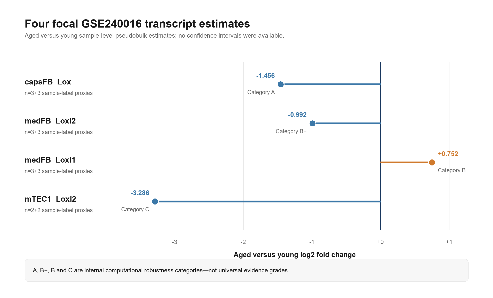
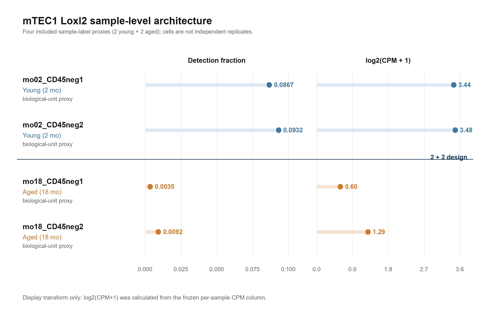
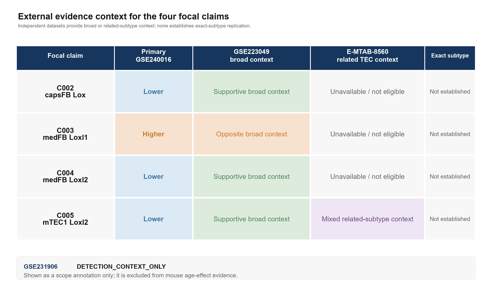

# Subtype-dependent LOX-family transcript changes in aging murine thymic stroma

**Aliaksandr Karatseyeu**  
Independent researcher, Warsaw, Poland  
ORCID: [0009-0006-3385-0054](https://orcid.org/0009-0006-3385-0054)  
Correspondence: Aliaksandr Karatseyeu\
Code and materials: [github.com/G1F12/ThymusLOXScan](https://github.com/G1F12/ThymusLOXScan)

**Manuscript version:** 6.0

## Abstract

Age-associated thymic involution involves epithelial and mesenchymal stromal changes, but lysyl oxidase (LOX) family transcripts have not been well described at stromal-subtype resolution. We computationally reanalyzed 22,932 CD45-negative thymic stromal cells from young and aged female mice in the public GSE240016 single-cell RNA-sequencing dataset, using sample-level pseudobulk inference and frozen sensitivity assessments. Four focal aged-versus-young directions were retained: lower `Lox` in capsular fibroblasts (log2 fold change -1.456; three young and three aged sample labels), lower `Loxl2` in medullary fibroblasts (-0.992; 3+3), higher `Loxl1` in medullary fibroblasts (+0.752; 3+3), and lower `Loxl2` in mTEC1 (-3.286; 2+2). The pattern was subtype-dependent rather than a uniform LOX-family response. Quality-control, leave-one-sample-out, matched sparse-gene, and annotation-confidence analyses preserved the focal directions where estimable, but they did not create independent biological replication. Interpretation remains limited by small biological-replicate counts, sparse detection, lower aged sequencing depth and detected-gene counts, biological-unit proxy labels, annotation uncertainty, and unresolved sample or batch confounding. Independent mouse datasets supplied supportive, opposite, weak/null, or mixed broad and related-subtype transcript context; none provided an exact capsFB, medFB, or mTEC1 comparison. GSE231906 contributed only within-expression-unit human detection context among uniquely joined barcodes because independent donor identity was not established; it was not used as human age-effect evidence. External evidence was therefore mixed and contextual. This hypothesis-generating study identifies subtype-associated LOX-family transcript directions in GSE240016, including a candidate aged-lower mTEC1 `Loxl2` pattern, while requiring orthogonal experimental follow-up before protein, activity, matrix, functional, or cross-species interpretation.

## Introduction

The thymus supports T-cell development through a specialized stromal microenvironment composed of thymic epithelial cells, fibroblasts, endothelial cells, and other non-hematopoietic populations. With age, thymic involution reduces the production of naïve T cells and is accompanied by changes in epithelial organization, mesenchymal states, extracellular matrix, and inflammatory signaling [1-6]. Recent single-cell and spatial studies have resolved stromal heterogeneity that is obscured by whole-tissue or broad-compartment measurements. This resolution matters because an age-associated shift observed after pooling cell states can arise from altered composition, altered expression within a subtype, or both.

The lysyl oxidase family comprises `Lox` and the four LOX-like genes `Loxl1`-`Loxl4`. Their protein products are copper-dependent amine oxidases associated with collagen and elastin crosslinking and with extracellular-matrix organization [7-10]. Individual family members also have distinct tissue associations: LOXL1 contributes to elastic-fiber homeostasis, and LOXL2 has been studied in basement-membrane collagen crosslinking and vascular or fibrotic remodeling [11-13]. These biological roles make LOX-family transcripts plausible candidates for exploratory analysis in an aging stromal atlas, but transcript differences alone do not establish protein abundance, enzymatic activity, matrix remodeling, or physiological consequence.

Single-cell RNA sequencing creates an additional inferential challenge. Cells sampled from the same animal or library are not independent biological replicates. Treating each cell as an independent unit can underestimate uncertainty and produce anticonservative differential-expression results [14-16]. A sample-level pseudobulk design is therefore preferable when the scientific comparison concerns biological samples. Even then, small biological sample sizes, sparse gene detection, annotation uncertainty, and batch structure limit interpretation.

This study is a computational reanalysis of public data, not a new dataset search or a new biological experiment. Its primary objective was to characterize four accepted subtype-associated LOX-family age-direction estimates in GSE240016 and to determine how those estimates behave under prespecified internal robustness analyses. Secondary objectives were to place the estimates within broad or related-subtype mouse context, to define a strictly limited human detection context, and to organize experimental follow-up without treating prioritization scores as evidence. The scope is explicitly exploratory. The analysis does not test causality, protein localization, tissue mechanics, thymic function, or treatment response.

## Materials and Methods

### Study design and datasets

The computational chain used four principal public datasets and retained developmental human resources only as optional context. GSE240016 was the primary discovery dataset: a processed annotated single-cell RNA-sequencing object containing CD45-negative thymic stromal cells from 2-month and 18-month female C57BL/6 mice [5,6]. The analytical biological unit was the repository `sample` label, used as a proxy for an individual biological unit because an explicit mouse-to-library key was unavailable. The focal fibroblast analyses included three sample labels per age, and the mTEC1 analysis included two per age.

GSE223049 was used as an independent mouse sorted-bulk RNA-sequencing dataset spanning young 2-month and aged 22-24-month samples. Its broad `Thymic_fibroblasts` and `Thymic_epithelial` populations could provide compartment-level directional context but could not reproduce capsFB, medFB, or mTEC1 definitions. Exact permutations of the available sample labels were used for the accepted small-sample external summaries; their interpretation remained descriptive because the population definitions and age design differed from GSE240016.

E-MTAB-8560 was used as an independent mouse TEC Smart-seq2 age series with broad TEC, cTEC, mTEClo, mTEChi, and combined mTEC-like summaries [19]. Official SDRF metadata and a Bioconductor-derived `MouseThymusAgeing` export enabled mouse-level aggregation for the accepted analysis. The dataset spans developmental and early-aging contrasts through approximately the first year of life, has platform and batch limitations, and contains no fibroblast compartment. Its mTEC-related labels are related to, but not identical with, GSE240016 mTEC1.

GSE231906 was used only after a data-integrity assessment [20]. It contains 59 expression units and cell-level metadata, but the available person/sample identifiers did not establish high-confidence independent persons. A strict unit-scoped barcode join linked 387,762 of 590,533 expression barcodes uniquely. The expression representation was classified `COUNT_LIKE_PROBABLE`. Therefore, the accepted endpoint was LOX-family detection within joined expression units, not donor-level aging inference, cross-species effect comparison, or human aging evidence.

Earlier human developmental thymus datasets and public protein or spatial resources were retained as optional background or feasibility context when present in the repository. They were not used to upgrade any focal robustness category and were not treated as independent aging evidence. Dataset roles, checksums, availability, and clean-room staging status are recorded in the final dataset input manifest.

### GSE240016 input and annotation

The authoritative input was `data/raw/GSE240016_CD45neg_thymic_stroma_d0+annotation.h5ad`, corresponding to the GEO supplementary H5AD file [6]. Its recorded SHA-256 checksum is `a5cf4baeb408412947de2ae1867b4ad42271088c34c9dd212479c8b19e119fb1`. The object contained 22,932 cells. The accepted analysis used integer counts from `.raw.X`, while processed expression in `.X` was used only for explicitly descriptive or robustness summaries.

Metadata fields included `stage`, `sample`, broad `cell_type`, fine `cell_type_subset`, `n_genes_by_counts`, `total_counts`, and `mito_frac`. The published annotations were retained rather than re-inferred. Focal labels were `3:capsFB`, `5:medFB`, and `13:mTEC1`; `4:intFB` was included in annotation and composition checks. Age was encoded as `02mo` and `18mo`, and the available design information described female C57BL/6 mice. Sample labels were treated as biological-unit proxies, not proven animal identifiers. No authoritative public key was available to map each mouse unambiguously to every analytical library.

The repository audit compared raw and processed objects, recorded their roles, and avoided using prior generated results as hidden inputs. Available preparation and run metadata did not resolve whether age and batch were separable. The age-batch status was consequently fixed as `UNKNOWN`; sensitivity analyses were not interpreted as removing that uncertainty.

### Primary pseudobulk analysis

The primary inferential unit was a subtype-by-sample pseudobulk. Integer counts from `.raw.X` were summed for each gene within each accepted subtype and sample label. Sample-subtype groups with fewer than 10 cells were excluded. Biological sample labels, not cells, served as replicates. The model was implemented with PyDESeq2 using design `~ stage`, reference level `02mo`, and contrast `18mo` versus `02mo` [17,18]. Positive log2 fold changes indicate higher expression in aged samples.

The canonical v5.6 analysis applied its accepted gene filtering before model fitting and reported `baseMean`, log2 fold change, standard error, Wald statistic, nominal P value, and Benjamini-Hochberg adjusted P value [21]. The four values frozen for this manuscript are the canonical v5.6 results, not the slightly different internal robustness-filter estimates. The robustness analyses intentionally used accepted filtering and reruns to test direction stability; those values are sensitivity estimates and do not replace the canonical focal values.

The LOX-family target set comprised `Lox`, `Loxl1`, `Loxl2`, `Loxl3`, and `Loxl4`. Multiple testing within the authoritative differential-expression results used the Benjamini-Hochberg procedure. Statistical significance in the small dataset was not treated as proof of a biological mechanism, and robustness categories were assigned from the complete internal-evidence framework rather than from adjusted P values alone.

### Sample-level descriptive summaries

For each subtype, sample, and target gene, the workflow recorded contributing cell count, total raw counts, library size, counts per million (CPM), log2(CPM+1), number of positive cells, and detection fraction defined as the proportion of cells with raw count greater than zero. Samples were ordered by age and stable sample identifier. These summaries supported visual inspection of direction and detection architecture but did not replace pseudobulk inference.

Processed-expression summaries and raw-count CPM summaries were kept distinct. Per-cell tests and correlations inherited within-sample dependence and were therefore descriptive. They were retained from v5.6 as historical/supporting material where their lineage was known, but the final computational consolidation did not use them to create or strengthen a focal claim.

### Internal robustness analyses

The internal robustness analyses evaluated the four focal directions within GSE240016 using accepted configurations only. A prespecified quality-control grid varied cell-level gene-count, total-count, and mitochondrial-fraction thresholds. Focal sample-subtype groups were reaggregated after filtering, and the sign of each eligible estimate was compared with the accepted direction. Raw-count and processed-object summaries were also compared to determine whether a direction depended on one expression representation.

Leave-one-sample-out refits were performed only when at least two samples per age group remained after omission. The accepted log2-fold-change ranges were -1.908 to -1.225 for capsFB `Lox`, -1.120 to -0.881 for medFB `Loxl2`, and +0.501 to +0.886 for medFB `Loxl1`. A leave-one-out refit was not estimable for mTEC1 `Loxl2`, because its starting design was 2+2 and omission would leave one replicate in one age group.

The accepted Python/PyDESeq2 pipeline was reproducible in the available environment. Rscript and the required Bioconductor stack were unavailable, so edgeR/limma comparisons remained `BLOCKED_RSCRIPT_UNAVAILABLE`. The final computational consolidation did not install an arbitrary R environment or add an alternative statistical result. The same-cohort robustness grid and leave-one-out checks were interpreted only as internal computational sensitivity.

### Matched sparse-gene null analysis

The matched sparse-gene null analysis examined whether the mTEC1 `Loxl2` pattern was unusual relative to similarly sparse genes without using age-effect statistics to construct the matched pool. The eligible universe was defined from raw-count abundance, detection, and technical support variables in the mTEC1 data. Primary matching used abundance and detection features, with separate abundance-only, detection-only, and tighter joint sensitivity specifications. Each specification selected a 200-gene matched pool under a fixed seed and documented matching distances and eligibility.

The primary combined-extremeness score integrated absolute pseudobulk effect, aged-lower direction, detection decrease, logCPM decrease, sample ordering, and direction retention after accepted thinning summaries. In the primary pool, `Loxl2` was at the 98.5th empirical percentile; the conditional equal-or-more-extreme tail was 3 of 200 genes, or 0.0199005 with the accepted finite-sample calculation. `Cdh2`, `Rasl10a`, and `Wdr72` were the three primary genes at least as extreme under the combined score, preserving interpretable matched controls rather than presenting `Loxl2` as unique.

Depth-thinning simulation used 5,000 fixed-seed iterations to ask whether the accepted downsampling mechanism reproduced the joint event. There were 0 events in 5,000 iterations. The corrected add-one estimate was 0.00019996, with an accepted upper 95% bound of 0.000598967. A zero observed count was not reported as zero probability. The simulation approximated sequencing-depth loss through binomial thinning and did not model all biological or technical sources of sparse detection.

The matched null was conditional on the eligible universe and matching variables, and the empirical tail was not a general-population P value. The final verdict remained `UNUSUAL_SPARSE_GENE_SIGNAL`; internal robustness category C was not upgraded. The analysis did not remove the n=2+2, age-batch, annotation, or external-replication limitations.

### Annotation-confidence analysis

The annotation-confidence analysis assessed whether the focal signs depended on low-confidence cells within the published annotations. Marker sets were predefined for capsFB (`Dpp4`, `Smpd3`, `Pi16`, `Pdgfra`), intFB (`Inmt`, `Gpx3`, `Pdgfra`), medFB (`Ptn`, `Postn`, `Pdgfra`), and mTEC1 (`Ccl21a`, `Itgb4`, `Ly6a`, `Epcam`, `H2-Aa`, `Krt8`, `Krt5`). Target-marker scores summarized scaled expression and detection across the designated markers; anti-lineage or mixed-identity scores recorded incompatible marker support. Leave-one-marker-out scores tested dependence on any single marker.

Cells were assigned published-label, moderate-confidence, high-confidence, and high-confidence-non-doublet tiers using the accepted marker-score, minimum-detection, and mixed/doublet-like rules. Pseudobulk estimates were recomputed across valid tiers without redefining the focal labels. All required libraries were retained: 3+3 for capsFB and medFB and 2+2 for mTEC1. In the high-confidence-non-doublet tier, cell-retention fractions were 0.982 for capsFB, 0.915 for medFB, and 0.982 for mTEC1.

The medFB audit retained an important asymmetry: high-confidence retention was lower in aged than young medFB cells (0.880 versus 0.970; absolute difference 0.089), and sample-level retention range was 0.140. Focal signs nevertheless persisted across descriptive, PyDESeq2, and leave-one-marker-out analyses. This supports robustness to the accepted filtering scheme but does not establish annotation truth.

Independent reference mapping could not be completed with the accepted local inputs and was recorded as blocked. No new mapping workflow was substituted. All four final annotation verdicts remained `ROBUST_TO_ANNOTATION_FILTERING`, explicitly as same-cohort sensitivity with no robustness-category upgrade.

### External mouse datasets

For GSE223049, accepted counts for sorted broad thymic fibroblast and epithelial samples were normalized by library size to CPM and transformed as log2(CPM+1). High-age minus low-age differences were calculated from sample-level values. Exact enumeration of the available age-label permutations avoided asymptotic assumptions in the small groups. The dataset's broad sorting, older aged group, and lack of capsFB, medFB, and mTEC1 labels constrained all interpretations to compartment-level context.

For E-MTAB-8560, official SDRF information was joined to the accepted processed Smart-seq2 resource and expression was aggregated by mouse. Predefined comparisons summarized younger and older ages for broad TEC, cTEC, mTEClo, mTEChi, and combined mTEC-like populations. The accepted results were mixed across TEC definitions, age contrasts, and batch-aware models. No E-MTAB fibroblast mapping exists, and none was inferred.

External rows were assigned an evidence class before synthesis: broad-compartment context, related-subtype context, exact-subtype candidate, or not eligible. Differences in technology, age range, cell definition, and biological unit were retained in every mapping. No external row met exact-subtype eligibility for any of the four focal claims.

### GSE231906 integrity-gated human context

The GSE231906 data-integrity assessment first inventoried archives, metadata, and expression units and computed checksums for available inputs. The accepted join was strict and unit-scoped: an expression barcode was linked only within its originating expression unit, duplicate metadata keys were not silently resolved across units, and ambiguous keys were excluded. Of 590,533 expression barcodes across 59 units, 387,762 joined uniquely.

Identity fields were audited separately from barcode linkage. Duplicate or reused metadata identifiers prevented a defensible reconstruction of independent donor counts, and the number of high-confidence persons was zero. Missing authoritative person/sample keys were classified as `MISSING_SCOPE_EXPANSION_INPUT`: they would be required for donor-level age modeling, but their absence does not invalidate the accepted detection-only endpoint.

Matrix characteristics supported the label `COUNT_LIKE_PROBABLE`, not a stronger assertion about raw UMI semantics. The accepted summaries used presence/absence of LOX-family expression within uniquely joined barcodes and within-unit descriptive expression. No cells were treated as independent donors, no donor-level aging model was fitted, and no cross-species effect size was inferred. Developmental human datasets and protein resources, when mentioned, supply only optional detectability or anatomical context.

### Cross-dataset evidence synthesis

The cross-dataset evidence synthesis converted the accepted outputs into 23 evidence atoms linked to four focal claims. Each atom recorded dataset, population, endpoint, direction, exactness, analytical role, limitations, and an independence group. The 23 atoms collapsed into five biological evidence families after dependencies were made explicit. Same-cohort QC, reaggregation, sparse-null, and annotation audits were not counted as new biological cohorts.

An external atom was eligible for exact replication only if it used an independent biological dataset, matched the focal subtype and gene, provided an age contrast with a compatible biological unit, and had adequate lineage. The number of exact-replication-eligible external atoms was zero. The synthesis therefore allowed wording such as “internally directionally stable,” “supportive broad context,” “opposite broad context,” and “related-subtype context.” It did not allow external subtype replication, human aging support, or conservation language.

The frozen A, B+, B, and C labels are internal computational robustness categories. They summarize accepted same-cohort behavior and known limitations; they are not a universal evidence-grading framework and do not grade evidence strength across species or datasets.

### Reproducibility documentation

The reproducibility audit constructed isolated execution roots containing tracked files from the accepted base commit, explicit input manifests, separate output roots, and separate cache and temporary roots. Inputs were classified as direct computational, explicit synthesis, audit inventory, historical non-authoritative, optional context, or missing scope expansion. Checksums were required for available computational inputs, and inventory-only files were not misclassified as missing computational inputs.

The release includes environment specifications, scripts, input provenance, and frozen-output checks to support inspection and future reproduction. A fully independent clean-room reproduction was not completed before this release. Missing person identity metadata affects only expanded donor-level claims, not the accepted detection-only endpoint.

Outputs were assigned byte-identical, numerically identical, semantically equivalent, blocked, failed, or not-applicable policies before comparison. Numerical comparisons used predetermined absolute and relative tolerances no wider than 1e-8 unless specifically justified, with key alignment, ordering, NaN, and formatting rules recorded in the audit. Two isolated `FULL_LOCAL` attempts reproduced the available Python core but remained partial because specified external inputs and the R/Bioconductor environment were unavailable. `RELEASE_DERIVED` checks completed without numerical invariant failures. The release therefore does not claim complete clean-room reproduction of every historical workflow.

### Candidate prioritization

The experimental prioritization framework translated the frozen evidence and uncertainty records into an experimental-planning framework. Candidate-assay pairs received component scores for internal robustness, expected information gain, feasibility, interpretability, and risk. Three scenarios—evidence-first, information-gain-first, and practical-first—used predefined weights. Sensitivity analysis assessed how scenario ranks changed within the accepted weight definitions.

The resulting scores are decision aids, not biological observations. They do not change a focal robustness category, add an evidence atom, establish a reagent, or imply that a higher-ranked candidate is more biologically important. Reagent availability and specificity require manual verification before any experiment.

## Results

### Four focal GSE240016 transcript associations

The final focal matrix retained four GSE240016 aged-versus-young estimates (Table 1; Figure 1). capsFB `Lox` was lower in aged samples (log2 fold change -1.456; 3+3 sample labels; category A). medFB `Loxl2` was lower (-0.992; 3+3; B+), whereas medFB `Loxl1` was higher (+0.752; 3+3; B). mTEC1 `Loxl2` was lower (-3.286; 2+2; C). These are the authoritative v5.6 numerical values.

**Table 1. Frozen focal GSE240016 estimates.**

| Focal comparison | Aged vs young log2FC | Biological n | Internal robustness | Exact external replication |
|---|---:|---:|---:|---|
| capsFB `Lox` | -1.456 | 3+3 | A | Not established |
| medFB `Loxl2` | -0.992 | 3+3 | B+ | Not established |
| medFB `Loxl1` | +0.752 | 3+3 | B | Not established |
| mTEC1 `Loxl2` | -3.286 | 2+2 | C | Not established |

The Table 1 labels are internal computational robustness categories, defined once for this study rather than as a universal evidence-grading framework. Category A for capsFB `Lox` does not mean external evidence is stronger than for the other candidates; it means that the accepted internal checks were more complete and less fragile. Category C for mTEC1 `Loxl2` retains the sparse expression and 2+2 design limitations despite its large estimated fold change.

The focal pattern was subtype-dependent rather than uniform. In particular, medFB contained opposite directions for two family members, with higher `Loxl1` and lower `Loxl2` in aged samples. These results are transcript associations within published labels. They do not establish a shared enzymatic program or a compartment-wide matrix phenotype.

::: figure-block

**Figure 1. Four focal GSE240016 transcript estimates.** The source dataset is GSE240016, and the analytical unit is the subtype-by-sample pseudobulk using repository sample labels as biological-unit proxies. The displayed aged-versus-young log2 fold-change estimates are inferential outputs; no confidence intervals were fabricated because none was available in the frozen focal table. Internal computational robustness categories are shown for orientation. Interpretation is limited by small sample counts, proxy biological-unit labels, and unresolved age-batch structure.
:::

### Internal robustness

The quality-control grid retained the focal signs across all accepted, estimable configurations. Raw-count CPM and processed-object descriptive representations also retained the directions, although effect magnitudes differed as expected between representations and filtering rules. This distinction is why the v5.6 canonical values remain the headline estimates and the internal robustness estimates remain sensitivity outputs.

Leave-one-sample-out refits retained negative capsFB `Lox` estimates from -1.908 to -1.225, negative medFB `Loxl2` estimates from -1.120 to -0.881, and positive medFB `Loxl1` estimates from +0.501 to +0.886. The exercise showed that no single eligible sample label alone determined those signs. It did not create an independent cohort. mTEC1 `Loxl2` had no valid leave-one-out result because a refit would reduce one group to a single biological-unit proxy.

The robustness audit did not resolve batch. Age-batch status remains `UNKNOWN`, and sample labels remain biological-unit proxies. Cross-method checking with edgeR/limma remains blocked by unavailable Rscript/Bioconductor. The accepted robustness categories incorporate these unresolved conditions.

### mTEC1 Loxl2 sparse-gene assessment

The primary matched pool contained 200 genes chosen without age-effect leakage. The `Loxl2` combined-extremeness score was at the 98.5th empirical percentile. Three matched genes—`Cdh2`, `Rasl10a`, and `Wdr72`—were equal or more extreme, yielding a conditional tail of 0.0199005 under the accepted finite-pool calculation. Sensitivity pools based on abundance only, detection only, or tighter joint matching retained an unusual ranking, but the exact tail depended on how sparse-gene comparability was defined.

No joint simulation event occurred in 5,000 fixed-seed depth-thinning iterations. The corrected estimate was 0.00019996 and the upper 95% bound was 0.000598967. This result argues that the specified thinning mechanism rarely reproduced the full observed pattern; it does not exclude unmodeled batch, biology, cell selection, annotation error, or other technical mechanisms.

The final matched sparse-gene assessment was `UNUSUAL_SPARSE_GENE_SIGNAL`. The result remained category C. The combination of a large pseudobulk estimate, ordered sample summaries, low aged detection, and an unusual matched-null position makes the observation useful for a discriminating follow-up assay, but its 2+2 design and sparse expression make it high risk (Figure 2).

::: figure-block

**Figure 2. mTEC1 `Loxl2` sample-level architecture.** The source dataset is GSE240016, and the analytical units shown are the four included repository sample labels used as biological-unit proxies: two young and two aged. Detection fraction and log2(CPM+1) are descriptive sample-level summaries; cells are not treated as independent replicates, and no inferential P value is shown. Lower aged sequencing depth and detection, sparse expression, the proxy status of the sample labels, and residual batch uncertainty remain unresolved.
:::

### Annotation-confidence robustness

All four focal signs were preserved across every valid annotation-confidence tier. The high-confidence-non-doublet filter retained 98.2% of published capsFB cells, 91.5% of medFB cells, and 98.2% of mTEC1 cells, while preserving all focal libraries. The corresponding annotation-confidence assessment for each focal comparison was `ROBUST_TO_ANNOTATION_FILTERING`.

medFB required a more qualified interpretation. Aged medFB cells had lower high-confidence retention than young cells (0.880 versus 0.970), and sample retention varied more than in capsFB or mTEC1. Both medFB focal signs persisted, but the age-asymmetric filtering shows that marker coherence itself changed with age or sample composition. The audit therefore reduces concern about one simple low-confidence-cell explanation without demonstrating an immutable medFB identity.

Positive-cell summaries for mTEC1 `Loxl2` remained sparse across tiers and did not supply additional independent replication. Leave-one-marker-out analyses showed that the focal directions were not tied to a single marker in the accepted set. Independent reference mapping remained blocked, so annotation robustness was not upgraded to annotation corroboration.

### Broad and related-subtype external evidence

External mappings were claim-specific (Table 2). For C002, capsFB `Lox`, GSE223049 broad thymic fibroblasts had an aged-lower delta log2(CPM+1) of -0.354, providing supportive broad context. Broad thymic epithelial `Lox` was -0.038 and was retained separately as weak/null epithelial context rather than merged with the fibroblast result.

For C003, medFB `Loxl1`, GSE223049 broad fibroblasts had a weak aged-lower delta of -0.112, opposite to the positive medFB estimate. This was classified `APPARENT_COMPARTMENT_DIFFERENCE`: broad aggregation cannot resolve whether the difference reflects subtype composition, subtype-specific regulation, or another design difference.

For C004, medFB `Loxl2`, broad fibroblast `Loxl2` was aged-lower by -1.206 and supplied supportive broad context. For C005, mTEC1 `Loxl2`, broad epithelial `Loxl2` was aged-lower by -0.588. E-MTAB-8560 added mixed mTEClo, mTEChi, cTEC, and combined TEC context, with population- and contrast-dependent results.

**Table 2. Accepted external mapping of the four focal claims.**

| Claim | Internal focal estimate | External comparison | External delta | Interpretation |
|---|---|---|---:|---|
| C002 capsFB `Lox` | -1.456 | GSE223049 broad fibroblast | -0.354 | Supportive broad context |
| C002 capsFB `Lox` | -1.456 | GSE223049 broad epithelium | -0.038 | Separate weak/null context |
| C003 medFB `Loxl1` | +0.752 | GSE223049 broad fibroblast | -0.112 | Opposite broad context; apparent compartment difference |
| C004 medFB `Loxl2` | -0.992 | GSE223049 broad fibroblast | -1.206 | Supportive broad context |
| C005 mTEC1 `Loxl2` | -3.286 | GSE223049 broad epithelium | -0.588 | Supportive broad context |
| C005 mTEC1 `Loxl2` | -3.286 | E-MTAB-8560 TEC subsets | Mixed | Related-subtype context |

Exact external subtype replication was not established for C002, C003, C004, or C005. GSE223049 is broad sorted bulk, and E-MTAB-8560 has no fibroblast mapping and no exact mTEC1 label. The external results therefore constrain interpretation rather than convert internal sensitivity into replication.

::: figure-block

**Figure 3. External transcript-level evidence context.** Sources are the primary GSE240016 sample-level pseudobulk estimates, GSE223049 broad sorted mouse compartments, and E-MTAB-8560 related mouse TEC populations. The analytical units follow each source dataset; the external classifications are descriptive contextual mappings rather than inferential replication tests. Population definitions, technologies, age ranges, and biological units differ, and no external dataset establishes exact capsFB, medFB, or mTEC1 replication. GSE231906 is shown only as a separated `DETECTION_CONTEXT_ONLY` scope annotation and is not age-effect evidence.
:::

### Human detection context

The GSE231906 integrity gate found 590,533 expression barcodes across 59 units, of which 387,762 joined uniquely to unit-scoped metadata. Duplicate metadata keys and non-independent person identifiers prevented donor reconstruction; zero high-confidence persons were available. The matrix was classified `COUNT_LIKE_PROBABLE`.

LOX-family genes and epithelial or mTEC-like labels were detectable among the uniquely joined barcodes, supporting only technical feasibility for sample-unit detection summaries. The analysis made no donor-level age comparison, no cell-level inferential test, and no human-versus-mouse effect comparison. Consequently, GSE231906 is `DETECTION_CONTEXT_ONLY`, not human aging evidence.

### Evidence hierarchy

Directly estimated evidence consists of the four sample-level GSE240016 pseudobulk contrasts and their descriptive sample summaries. Internally supported evidence comprises the accepted QC grid, raw/processed representation checks, leave-one-sample-out estimates, matched-null and thinning analyses, and annotation-confidence analyses. These layers share the same biological cohort.

Externally contextualized evidence comprises GSE223049 broad sorted populations and E-MTAB-8560 related TEC populations. These datasets are biologically independent but do not match the focal subtype definitions. GSE231906 belongs to a separate human detection-context layer and is not part of the mouse age-effect evidence.

Candidate interpretation includes the statement that a focal association may be useful for an experimental follow-up. No evidence supports protein change, spatial redistribution, altered LOX activity, extracellular-matrix crosslinking, a causal role in involution, treatment response, human conservation, or exact subtype replication.

### Experimental prioritization

The evidence-first scenario ranked C004, medFB `Loxl2`, first because it combines B+ internal robustness with supportive broad fibroblast context. The information-gain scenario ranked C003, medFB `Loxl1`, first because its internally positive subtype direction and opposite broad direction make subtype-resolved measurement especially informative. The practical-pilot scenario ranked C002, capsFB `Lox`, first because of category A internal robustness and a comparatively straightforward broad-context direction. C005, mTEC1 `Loxl2`, remained a high-information, high-risk candidate because an orthogonal subtype-resolved measurement could resolve an unusual sparse signal, but the present 2+2 evidence is fragile.

These rankings organize possible assays; they do not prove that the leaders are stronger biological effects. The selected scenario changes the leader, underscoring that the ranking is conditional on planning priorities. No reagent-specific claim is made without manual verification.

## Discussion

The accepted results describe a subtype-dependent pattern rather than a uniform LOX-family response in aging thymic stroma. capsFB `Lox`, medFB `Loxl2`, and mTEC1 `Loxl2` were lower in aged samples, whereas medFB `Loxl1` was higher. The divergence within medFB is especially important: pooling fibroblast subtypes can conceal or reverse a subtype-associated direction, so a broad fibroblast average is not a neutral substitute for subtype resolution.

The medFB `Loxl1` result illustrates this aggregation problem. GSE240016 medFB showed a positive aged-versus-young estimate, while GSE223049 broad fibroblasts showed a weak negative difference. The external observation is not a direct contradiction of the medFB estimate because the broad sorted population combines multiple states and uses a different age design and technology. It is nevertheless informative: it argues against describing medFB `Loxl1` as a fibroblast-wide aged-higher pattern and motivates a subtype-resolved assay that can distinguish cell abundance from within-state expression.

Internal robustness and external replication answer different questions. The QC grid, leave-one-out analysis, sparse-null assessment, and annotation-confidence filtering test whether a direction is sensitive to selected analytical choices within GSE240016. Directional persistence makes a one-setting computational artifact less likely under those specific checks. It cannot create new animals, resolve an unknown batch structure, or test the same subtype in an independent cohort. Conversely, GSE223049 and E-MTAB-8560 add biological independence but lose exact subtype comparability. Neither layer substitutes for the other.

The mTEC1 `Loxl2` result is the most statistically and biologically fragile focal association. Its large negative estimate is accompanied by sparse detection, lower aged depth, only two sample labels per age, and no estimable leave-one-out analysis. The matched sparse-gene null adds a useful observation: the joint pattern was unusual among technically matched sparse genes and was rarely reproduced by the specified thinning model. This finding narrows one artifact hypothesis but does not remove the broader uncertainties. The internal robustness category therefore remains C, and a subtype-resolved detection assay with independently sampled animals would be more informative than further reuse of the same cells.

The external mouse datasets add context at the resolution they actually contain. GSE223049 supports broad aged-lower fibroblast `Lox` and `Loxl2` and broad aged-lower epithelial `Loxl2`, while exposing the broad-versus-medFB difference for `Loxl1`. E-MTAB-8560 shows that `Loxl2` behavior in TEC compartments varies across subtype definition, age contrast, and analytical model. These results help prevent overgeneralization. They do not supply capsFB, medFB, or exact mTEC1 replication.

The human data have a still narrower role. The GSE231906 join demonstrates that LOX-family detection can be summarized within uniquely linked expression units and annotated human thymic compartments. Without a defensible independent-person key, a donor-level age model would risk pseudoreplication. The correct contribution of this dataset is therefore integrity-gated detectability and workflow feasibility, not evidence that the mouse associations extend to aging humans.

The experimental prioritization framework converts these uncertainties into experimental choices. C004 offers the strongest balance of internal robustness and broad mouse context; C003 offers a high-value test of subtype-versus-compartment direction; C002 offers a practical internally stable pilot; and C005 offers potentially large information gain with substantial failure risk. Such prioritization is useful only if its evidentiary boundary is preserved. A score is not a measured biological quantity.

The most direct next step would be an independent, balanced mouse cohort with explicit animal-to-library mapping and subtype-resolved measurement. RNA in situ hybridization, spatial transcriptomics, sorted-cell or nucleus-based quantification, and carefully qualified immunostaining could address localization and biological-unit replication. Protein abundance, enzymatic activity, matrix crosslinking, tissue mechanics, and thymic-output assays would be separate questions. The present work establishes neither those endpoints nor a therapeutic direction.

## Limitations

**Table 3. Principal limitations and reproducibility disposition.**

| Domain | Frozen limitation | Consequence |
|---|---|---|
| Biological unit | Sample labels are proxies; explicit mouse-to-library key is missing | Animal-level lineage cannot be independently reconstructed |
| Design | Age-batch status is unknown | Batch confounding is not excluded |
| Sample size | Fibroblast n=3+3; mTEC1 n=2+2 | Limited precision and leave-one-out feasibility |
| Sparse signal | mTEC1 `Loxl2` is detection- and depth-sensitive | Internal robustness category remains C |
| Methods | Rscript/Bioconductor unavailable | edgeR/limma comparison remains blocked |
| Annotation | Reference mapping blocked; medFB retention is age-asymmetric | Same-cohort filter robustness only |
| External evidence | Broad or related subtypes only | Exact subtype replication not established |
| Human context | Zero high-confidence persons in GSE231906 | Detection context only |
| Reproduction | Available Python core reproduced; `RELEASE_DERIVED` passed; `FULL_LOCAL` remained partial | No claim of complete clean-room reproduction |
| Orthogonal evidence | No protein, spatial, mechanistic, or functional assay | Transcript associations only |

The study is a reanalysis of public data centered on one primary single-cell dataset. The `sample` labels were used as biological-unit proxies because an explicit mouse-to-library key was unavailable. Although the source design describes female C57BL/6 mice, the repository cannot independently prove every animal-library mapping. The status of age versus sequencing or preparation batch is `UNKNOWN`, so age-batch confounding was not excluded.

Biological sample sizes are small. The three fibroblast contrasts have 3+3 sample labels, and mTEC1 `Loxl2` has only 2+2. A PyDESeq2 dispersion warning occurred in the small-sample workflow and is retained as an environment/model limitation rather than suppressed. Leave-one-sample-out analysis was not valid for mTEC1. Adjusted P values and large fold changes should therefore be read together with sample-level behavior and the full uncertainty record.

Sparse detection and depth differences are central for mTEC1 `Loxl2` and relevant to other LOX-family summaries. The matched-gene null is conditional on its eligible universe, matching features, and distance rules. Binomial thinning models a specific loss-of-depth mechanism and cannot reproduce batch effects, biological heterogeneity, ambient RNA, annotation error, or all count-generation processes. The 0/5000 simulation count does not imply zero probability.

The primary method was Python/PyDESeq2. Rscript and the required Bioconductor packages were unavailable in the reproducibility-audit environment, so edgeR/limma cross-method checks remain blocked. No replacement package versions were installed during final computational consolidation, and no new statistical estimate was introduced to fill that gap.

The analysis relies on published cell annotations. Marker scores, confidence tiers, mixed/doublet-like flags, and leave-one-marker-out checks test robustness to one predefined filtering framework. Independent reference mapping was blocked. medFB showed age-asymmetric high-confidence retention, which may reflect altered state, composition, annotation coherence, or technical quality. The preserved focal signs do not resolve those alternatives.

External datasets differ in technology, population definition, age range, batch structure, and biological unit. GSE223049 contains broad sorted fibroblast and epithelial samples, not capsFB, medFB, or mTEC1. E-MTAB-8560 contains TEC-related populations and no fibroblast mapping; its age design and mTEC labels are not identical to GSE240016. Exact subtype replication is absent for all four focal claims.

GSE231906 has substantial identity and join constraints. Only 387,762 of 590,533 barcodes joined uniquely within expression units, metadata keys were duplicated, and zero high-confidence persons could be established. Its matrix was classified `COUNT_LIKE_PROBABLE`. The accepted endpoint is within-unit detection context only. It cannot support donor-level aging inference, human aging support, or conservation.

The study contains no protein, spatial, mechanistic, functional, or causal evidence. It does not measure LOX secretion, enzymatic activity, collagen or elastin crosslinking, extracellular-matrix organization, tissue mechanics, thymic output, intervention response, or rejuvenation. Correlation or transcript direction cannot substitute for those measurements.

Clean-room reproducibility is also bounded. Two isolated `FULL_LOCAL` attempts reproduced the available Python core but remained partial because specified external inputs and the R/Bioconductor environment were unavailable. `RELEASE_DERIVED` checks completed without numerical invariant failures. The release therefore does not claim complete clean-room reproduction of every historical workflow.

## Conclusions

GSE240016 contains four focal subtype-associated mouse age-direction estimates that remain directionally stable across accepted internal sensitivity analyses. Independent mouse datasets provide broad or related-subtype context, but no exact subtype replication. The four categories describe internal computational robustness only, GSE231906 contributes detection context only, and experimental prioritization remains a planning layer. Independent biological-unit replication and orthogonal measurements are required before stronger biological interpretation.

## Reproducibility and code availability

Scripts, environment specifications, checksums, and reproduction instructions are provided in the versioned repository release. Two isolated `FULL_LOCAL` attempts reproduced the available Python core but remained partial because specified external inputs and the R/Bioconductor environment were unavailable. `RELEASE_DERIVED` checks completed without numerical invariant failures. The release therefore does not claim complete clean-room reproduction of every historical workflow.

Version 6.0 has no assigned DOI. Code and manuscript sources are maintained at [github.com/G1F12/ThymusLOXScan](https://github.com/G1F12/ThymusLOXScan).

## Data availability

GSE240016, GSE223049, and GSE231906 are available from the NCBI Gene Expression Omnibus under their accession records [6,20,22]. E-MTAB-8560 is available through ArrayExpress/BioStudies and its associated processed resource [19]. Third-party datasets remain subject to their source licenses and distribution terms. The final dataset input manifest records dataset role, local availability, size, checksum, clean-room staging status, provenance, and the effect of absence. Large public inputs are not necessarily redistributed in the release candidate.

## Author contributions

Aliaksandr Karatseyeu conceived the reanalysis, implemented and audited the computational workflows, interpreted the accepted results, and wrote the manuscript.

## Competing interests

The author declares no competing interests.

## Funding

This work received no external funding.

## References

1. Palmer DB. The effect of age on thymic function. *Front Immunol.* 2013;4:316. [doi:10.3389/fimmu.2013.00316](https://doi.org/10.3389/fimmu.2013.00316).
2. Thomas R, Wang W, Su DM. Contributions of age-related thymic involution to immunosenescence and inflammaging. *Immun Ageing.* 2020;17:2. [doi:10.1186/s12979-020-0173-8](https://doi.org/10.1186/s12979-020-0173-8).
3. Ki S, Park D, Selden HJ, Seita J, Chung H, Kim J, et al. Global transcriptional profiling reveals distinct functions of thymic stromal subsets and age-related changes during thymic involution. *Cell Rep.* 2014;9:402-415. [doi:10.1016/j.celrep.2014.08.070](https://doi.org/10.1016/j.celrep.2014.08.070).
4. Hamazaki Y. Adult thymic epithelial cell progenitors and stem cells: models and mechanisms for development and maintenance. *Eur J Immunol.* 2015;45:2985-2993. [doi:10.1002/eji.201545844](https://doi.org/10.1002/eji.201545844).
5. Kousa AI, Jahn L, Zhao K, Flores AE, Acenas D, Lederer E, et al. Age-related epithelial defects limit thymic function and regeneration. *Nat Immunol.* 2024;25:1593-1606. [doi:10.1038/s41590-024-01915-9](https://doi.org/10.1038/s41590-024-01915-9).
6. NCBI Gene Expression Omnibus. GSE240016: Age-related epithelial defects limit thymic function and regeneration. [GEO accession GSE240016](https://www.ncbi.nlm.nih.gov/geo/query/acc.cgi?acc=GSE240016).
7. Lucero HA, Kagan HM. Lysyl oxidase: an oxidative enzyme and effector of cell function. *Cell Mol Life Sci.* 2006;63:2304-2316. [doi:10.1007/s00018-006-6149-9](https://doi.org/10.1007/s00018-006-6149-9).
8. Vallet SD, Guéroult M, Belloy N, Dauchez M, Ricard-Blum S. Lysyl oxidases: from enzyme activity to extracellular matrix cross-links. *Essays Biochem.* 2019;63:349-364. [doi:10.1042/EBC20180050](https://doi.org/10.1042/EBC20180050).
9. Cox TR, Erler JT. Remodeling and homeostasis of the extracellular matrix: implications for fibrotic diseases and cancer. *Dis Model Mech.* 2011;4:165-178. [doi:10.1242/dmm.004077](https://doi.org/10.1242/dmm.004077).
10. Tschumperlin DJ, Ligresti G, Hilscher MB, Shah VH. Mechanosensing and fibrosis. *J Clin Invest.* 2018;128:74-84. [doi:10.1172/JCI93561](https://doi.org/10.1172/JCI93561).
11. Liu X, Zhao Y, Gao J, Pawlyk B, Starcher B, Spencer JA, et al. Elastic fiber homeostasis requires lysyl oxidase-like 1 protein. *Nat Genet.* 2004;36:178-182. [doi:10.1038/ng1297](https://doi.org/10.1038/ng1297).
12. Añazco C, López-Jiménez AJ, Rafi M, Vega-Montoto L, Zhang MZ, Hudson BG, Vanacore RM. Lysyl oxidase-like-2 cross-links collagen IV of glomerular basement membrane. *J Biol Chem.* 2016;291:25999-26012. [doi:10.1074/jbc.M116.738856](https://doi.org/10.1074/jbc.M116.738856).
13. Bignon M, Pichol-Thievend C, Hardouin J, Malbouyres M, Brechot N, Nasciutti L, et al. Lysyl oxidase-like protein-2 regulates sprouting angiogenesis and type IV collagen assembly. *Blood.* 2011;118:3979-3989. [doi:10.1182/blood-2010-10-313296](https://doi.org/10.1182/blood-2010-10-313296).
14. Crowell HL, Soneson C, Germain PL, Calini D, Collin L, Raposo C, et al. muscat detects subpopulation-specific state transitions from multi-sample multi-condition single-cell transcriptomics data. *Nat Commun.* 2020;11:6077. [doi:10.1038/s41467-020-19894-4](https://doi.org/10.1038/s41467-020-19894-4).
15. Squair JW, Gautier M, Kathe C, Anderson MA, James ND, Hutson TH, et al. Confronting false discoveries in single-cell differential expression. *Nat Commun.* 2021;12:5692. [doi:10.1038/s41467-021-25960-2](https://doi.org/10.1038/s41467-021-25960-2).
16. Murphy AE, Skene NG. A balanced measure shows superior performance of pseudobulk methods in single-cell RNA-sequencing analysis. *Nat Commun.* 2022;13:7851. [doi:10.1038/s41467-022-35519-4](https://doi.org/10.1038/s41467-022-35519-4).
17. Love MI, Huber W, Anders S. Moderated estimation of fold change and dispersion for RNA-seq data with DESeq2. *Genome Biol.* 2014;15:550. [doi:10.1186/s13059-014-0550-8](https://doi.org/10.1186/s13059-014-0550-8).
18. Muzellec B, Telenczuk M, Cabeli V, Andreux M. PyDESeq2: a Python package for bulk RNA-seq differential expression analysis. *Bioinformatics.* 2023;39:btad547. [doi:10.1093/bioinformatics/btad547](https://doi.org/10.1093/bioinformatics/btad547).
19. Baran-Gale J, Morgan MD, Maio S, Dhalla F, Calvo-Asensio I, Deadman ME, et al. Ageing compromises mouse thymus function and remodels epithelial cell differentiation. *eLife.* 2020;9:e56221. [doi:10.7554/eLife.56221](https://doi.org/10.7554/eLife.56221); dataset [E-MTAB-8560](https://www.ebi.ac.uk/biostudies/arrayexpress/studies/E-MTAB-8560).
20. NCBI Gene Expression Omnibus. GSE231906: Human thymus single-cell expression and metadata resource. [GEO accession GSE231906](https://www.ncbi.nlm.nih.gov/geo/query/acc.cgi?acc=GSE231906).
21. Benjamini Y, Hochberg Y. Controlling the false discovery rate: a practical and powerful approach to multiple testing. *J R Stat Soc B.* 1995;57:289-300. [doi:10.1111/j.2517-6161.1995.tb02031.x](https://doi.org/10.1111/j.2517-6161.1995.tb02031.x).
22. NCBI Gene Expression Omnibus. GSE223049: Mouse thymic aging sorted-cell RNA-sequencing resource. [GEO accession GSE223049](https://www.ncbi.nlm.nih.gov/geo/query/acc.cgi?acc=GSE223049).
23. Phipson B, Smyth GK. Permutation P-values should never be zero: calculating exact P-values when permutations are randomly drawn. *Stat Appl Genet Mol Biol.* 2010;9:Article39. [doi:10.2202/1544-6115.1585](https://doi.org/10.2202/1544-6115.1585).

## Supplementary materials map

- Input and environment lineage: `manifests/final_dataset_input_manifest_v6.tsv`, `manifests/phase1_cleanroom_input_manifest_v6.tsv`, and `manifests/phase1_cleanroom_environment_v6.json`.
- Primary focal estimates: `results/tables/final_focal_results_v6.tsv` and the accepted GSE240016 pseudobulk tables.
- Internal robustness analyses (Phase 2 provenance): QC-grid, raw-versus-processed, leave-one-out, blocker, and focal-category tables under `results/tables/`.
- Matched sparse-gene null analysis (Phase 3 provenance): matched-pool, extremeness, thinning-simulation, invariant, and final-verdict tables, with `reports/MTEC1_LOXL2_PHASE3_SPARSE_NULL_v6.md`.
- Annotation-confidence analysis (Phase 4 provenance): confidence-tier, leave-one-marker-out, retention-asymmetry, pseudobulk, and final-verdict tables.
- External evidence: `results/tables/final_external_evidence_v6.tsv` and accepted GSE223049/E-MTAB-8560 Phase 5 provenance tables.
- Human detection context: the GSE231906 join, identity, count-semantics, detection, and Phase 0/6A provenance tables.
- Cross-dataset synthesis: `results/tables/phase7_evidence_atom_registry_v6.tsv`, `results/tables/phase7_claim_evidence_matrix_v6.tsv`, and `manifests/final_claim_registry_v6.tsv`.
- Experimental prioritization framework (Phase 8 provenance): component-score, scenario-weight, ranking, sensitivity, assay, and validation-plan tables.
- Clean-room audit: `reports/PHASE1_CLEAN_ROOM_REPRODUCIBILITY_v6.md`, its acceptance record, input/output manifests, invariant checks, hidden-state audit, and blocker registry.
- Final computational consolidation (Phase 9 provenance): `manifests/final_authoritative_file_registry_v6.tsv`, release-asset manifest, checksum index, cross-file consistency table, and Phase 9 reports. The repository command is `python scripts/run_phase9_final_computational_freeze.py`.
